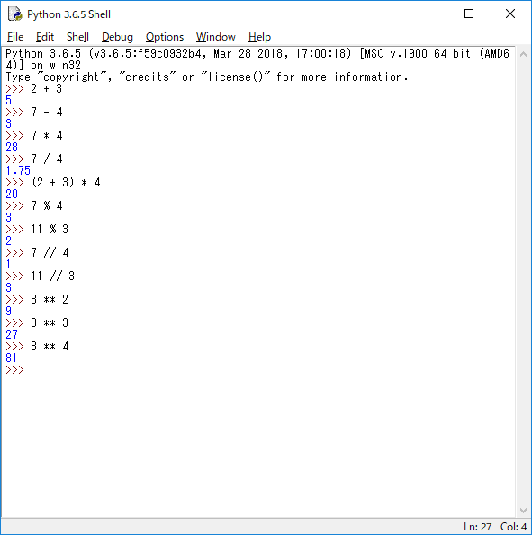
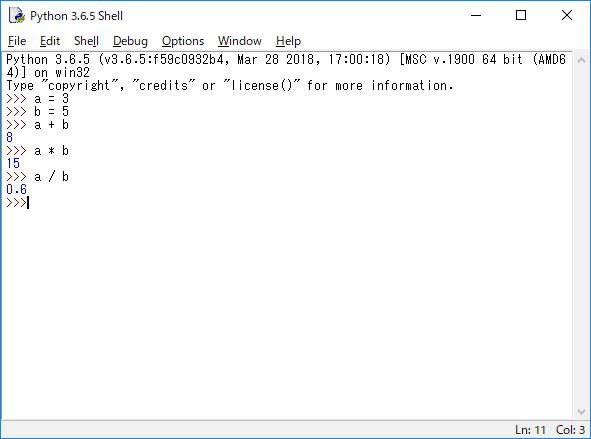
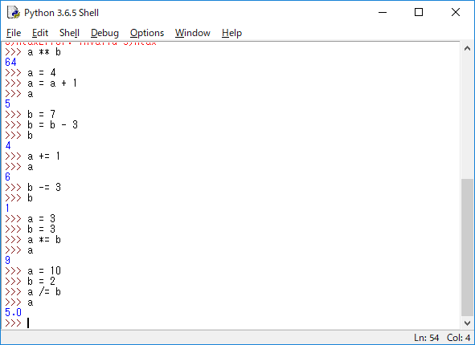
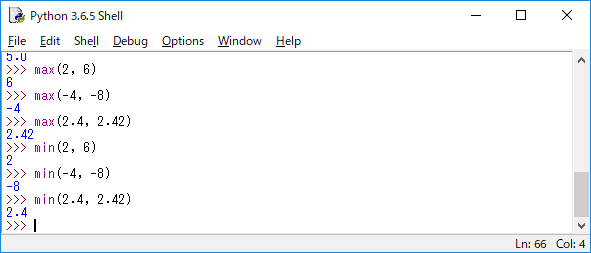
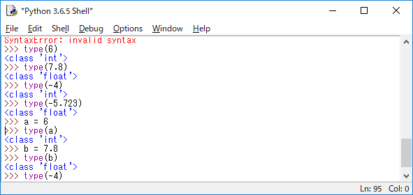
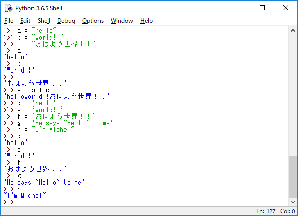
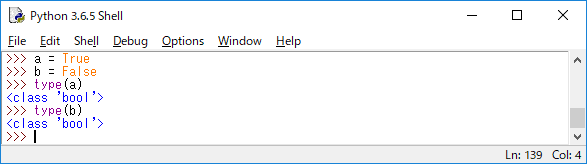

# Pythonメモ

## 1:演算

### 1-1:演算子について

下記のように演算子を使用します。

|     | 数学上の記号 | Python上の記号 |
| --- | ------ | ---------- |
| 加算  | +      | +          |
| 減算  | -      | -          |
| 乗算  | ×      | *          |
| 除算  | ÷      | /          |

他にもこのような演算子も存在します。

| 内容          | 記号  |
| ----------- | --- |
| 余りを求める      | %   |
| 商を整数で求める    | //  |
| べき乗（指数）を求める | **  |

演算結果の例

### 1-2:変数

変数に使用できる文字は、大小英文字/数字/アンダースコア「_」です。  
ただし、数字は先頭に使用できません。（※ほかの言語でも一緒ですね。）

### 1-3:代入の簡易記法

下記のように変数の代入を簡易化できます。

| 演算子 | 内容                            |
| --- | ----------------------------- |
| +=  | 自分自身に右辺の値を足して、その結果を自分自身に代入する  |
| -=  | 自分自身から右辺の値を減じて、その結果を自分自身に代入する |
| *=  | 自分自身に右辺の値を掛けて、その結果を自分自身に代入する  |
| /=  | 自分自身を右辺の値で割って、その結果を自分自身に代入する  |

### 1-4:関数

関数一覧

| 演算子      | 内容             |
| -------- | -------------- |
| max(a,b) | aとbで大きいほうの値を返す |
| min(a,b) | aとbで小さいほうの値を返す |

### 1-5:データ型

- 数値  
変数や値がどのような型になっているか確認する際は、type()を使用します。

- 文字列  
文字列を使用する場合は「""」または、「''」で囲みます。  
2種類存在する理由は、「"」や「'」も文字列として扱う場合があるためです。

- ブール値  
他の言語と同じですが、「True」、「False」の判定を行います。  
最初の一文字目は大文字で変数を定義します。

