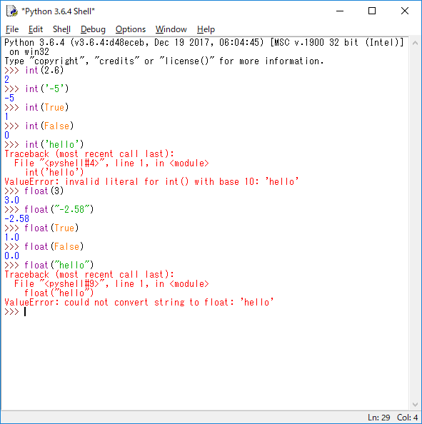
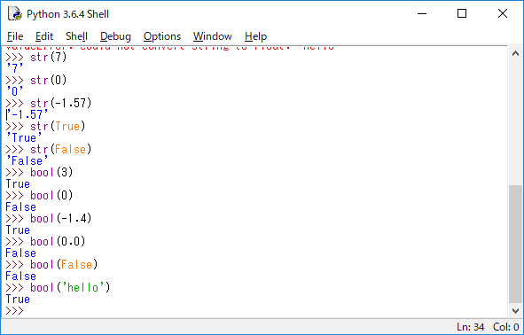
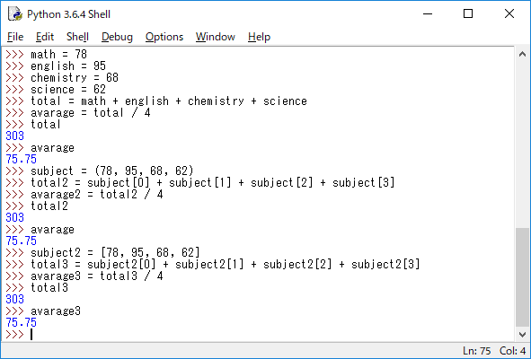
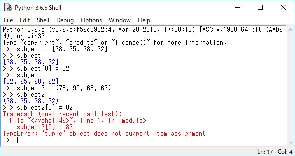
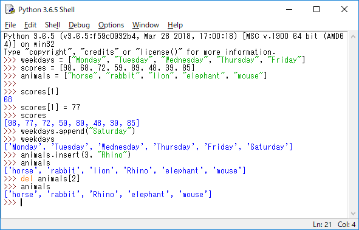
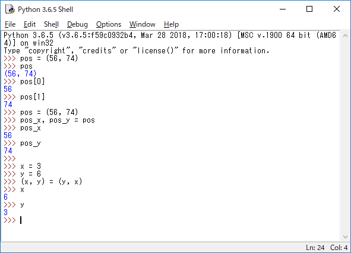
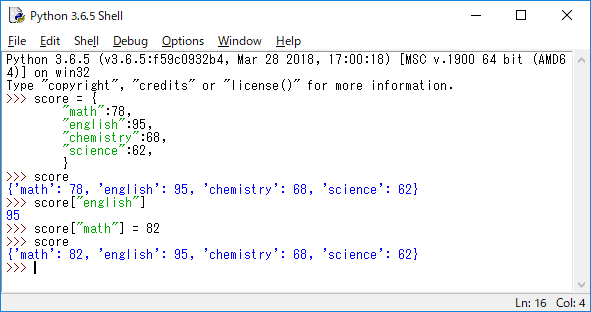
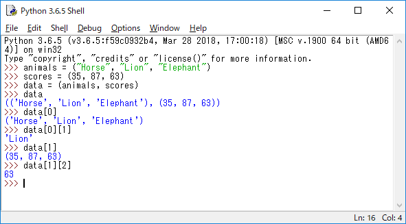

# Pythonメモ

## 1:演算

### 1-1:演算子について

下記のように演算子を使用します。

|     | 数学上の記号 | Python上の記号 |
| --- | ------ | ---------- |
| 加算  | +      | +          |
| 減算  | -      | -          |
| 乗算  | ×      | *          |
| 除算  | ÷      | /          |

他にもこのような演算子も存在します。

| 内容          | 記号  |
| ----------- | --- |
| 余りを求める      | %   |
| 商を整数で求める    | //  |
| べき乗（指数）を求める | **  |

演算結果の例

### 1-2:変数

変数に使用できる文字は、大小英文字/数字/アンダースコア「_」です。  
ただし、数字は先頭に使用できません。（※ほかの言語でも一緒ですね。）

### 1-3:代入の簡易記法

下記のように変数の代入を簡易化できます。

| 演算子 | 内容                            |
| --- | ----------------------------- |
| +=  | 自分自身に右辺の値を足して、その結果を自分自身に代入する  |
| -=  | 自分自身から右辺の値を減じて、その結果を自分自身に代入する |
| *=  | 自分自身に右辺の値を掛けて、その結果を自分自身に代入する  |
| /=  | 自分自身を右辺の値で割って、その結果を自分自身に代入する  |

### 1-4:関数

関数一覧

| 演算子      | 内容             |
| -------- | -------------- |
| max(a,b) | aとbで大きいほうの値を返す |
| min(a,b) | aとbで小さいほうの値を返す |

### 1-5:データ型

- 数値  
変数や値がどのような型になっているか確認する際は、type()を使用します。

- 文字列  
文字列を使用する場合は「""」または、「''」で囲みます。  
2種類存在する理由は、「"」や「'」も文字列として扱う場合があるためです。

- ブール値  
他の言語と同じですが、「True」、「False」の判定を行います。  
最初の一文字目は大文字で変数を定義します。

### 1-6:キャスト

- 整数への変換  
浮動小数点型の値やブール値、文字列を整数へ変換する場合はint()関数を使います。

- 文字列への変換  
数値やブール値を文字列に変換する場合はstr()関数を使います。
変換結果は「''」で囲まれています。

- ブール値への変換  
数値や文字列をブール値へ変換する場合はbool()関数を使います。  
0や0.0、空文字はFalseになりますが、それ以外はTrueです。

### 1-7:リスト、タプル、辞書

- リスト  
0個以上の要素を持つシーケンス（並び）です。  
要素を追加削除したり、要素を書き換えることが可能です。  
[]で要素を囲むことで作成します。

- タプル  
0個以上の要素を持つシーケンス（並び）です。  
リストとは違い、一度作成すると変更は不可能です。  
()で要素を囲むことで作成します。

- 辞書  
「キー(Key)」と「バリュー(Value)」を指定します。  
調べる単語を「キー」に、調べた結果の値を「バリュー」に設定します。  
{}でキーとバリューを指定して作成します。

変更できる配列のことを、__ミュータブル（mutable）__  
変更できない配列のことを、__イミュータル（immutable）__ と呼びます。

リストのほうが融通は利きますが、タプルには下記のメリットがあります。

1. 消費メモリが少なくで済む。  
2. 誤って書き換えてしまうことがない。

- リスト  
  - 0個以上の要素をカンマで区切り、全体を[]で囲って作成します。  
  含まれる要素は数値でも、文字列でも問題ないです。
  - appendメソッドを使うと、リストの末尾に要素を追加できます。
  - insertメソッドを使うと、指定した要素を追加できます。
  - del命令を使うと、リスト内の特定要素を削除できます。

- タプルの変数代入
  - 上記で記述したように、タプルは要素の変更ができません。  
  insert、append、delの操作も不可能です。
  - たとえば、ゲームでは位置座標（X座標の値、Y座標の値）を扱います。  
  まとめて管理したほうがいろいろと楽です。  
  このような場面では、複数の値を管理できるため、タプルを使用することが適しています。  
  逆に、1つのタプルを複数の変数に代入することも可能です。  
  これを __「アンパック」__ と呼びます。  
  また、応用すると1つの命令で変数の値を入れ替えたりもできます。

- 辞書  
辞書は、文字通り索引機能があります。  
別名 __「ハッシュテーブル」__ __「キー・バリューペア」__ と呼ばれます。  
キーの値は「""」で囲み、その値を「:」の後ろに記述します。  
データ型は任意ですが基本的にキーには文字列を使用することが多いです。

- リストのリスト  
リストの中にさらに、リストやタプルを格納することが可能です。

